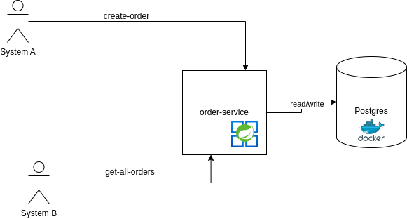
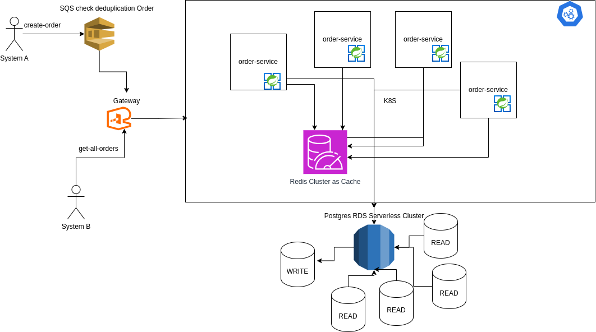
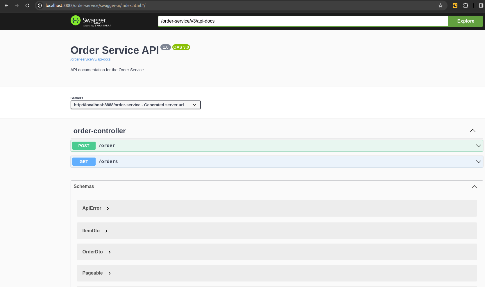

# Order Project

This is a Spring Boot project developed in Java that enables efficient order management, providing features such as order creation, pagination, and validation.
1. AS IS <br>

2. FUTURE <br>

3. SWAGGER (http://localhost:8888/order-service/swagger-ui/index.html) <br>
- 

## Prerequisites

Before you start, ensure that you have the following installed on your machine:

- [Docker](https://docs.docker.com/get-docker/)
- [Docker Compose](https://docs.docker.com/compose/install/)
- Java Development Kit (JDK) 21 

## How to Run

Follow the steps below to run the Spring Boot Java project along with Docker Compose.

1. **Clone the Repository**

   ```bash
   git clone <repository-url>
   cd project-directory

2. **Build the project**

   ```bash
   maven clean install

3. **Run docker compose**

   ```bash
   docker-compose up

4. **Run the project**

   ```bash
   spring-boot:run
